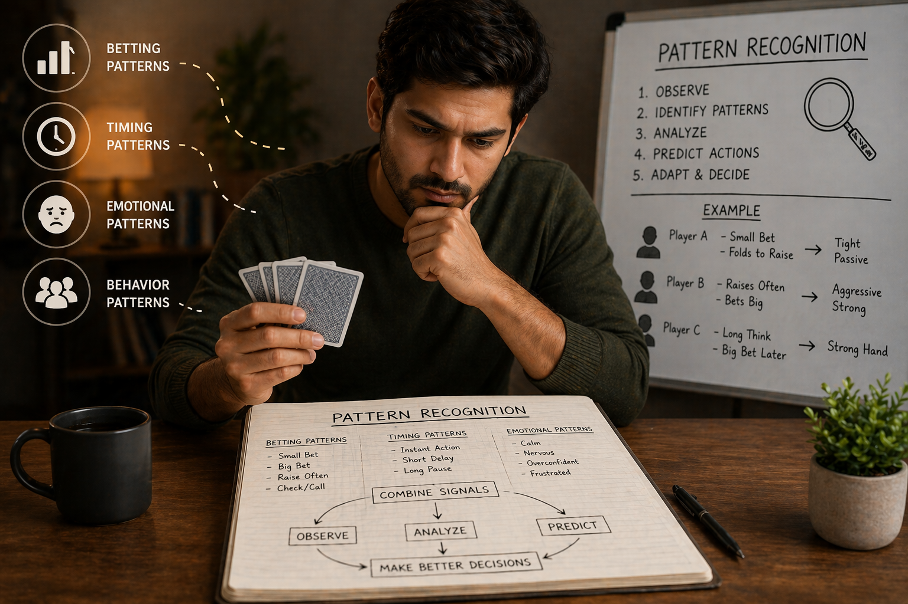

# 🔍 Pattern Recognition in Teen Patti: How to Read Behavior and Predict Moves

## 🪶 Introduction

In Teen Patti, the biggest advantage does not come from cards — it comes from **understanding patterns**.

Every player, whether they realize it or not, develops patterns in:

* Betting behavior
* Decision timing
* Emotional reactions

👉 If you can recognize these patterns, you can **predict actions before they happen**.

---

## 🖼️ Pattern Recognition Overview

---

## 🎯 What Is Pattern Recognition?

Pattern recognition is the ability to:

* Identify repeated behaviors
* Detect changes in behavior
* Use that information to make better decisions

👉 Instead of reacting randomly, you begin to **play with insight**.

---

## 🧠 1. Betting Pattern Recognition

One of the most important patterns is how players bet.

### Common betting patterns:

#### 📌 Consistent Small Bets

* Player prefers safety
* Usually cautious or unsure

#### 📌 Sudden Large Bets

* Could indicate strong hand
* Or a bluff attempt

#### 📌 Gradual Increase

* Building confidence
* Often strong or improving position

👉 Over time, these patterns become predictable.

---

## 🧠 2. Timing Patterns

How fast someone acts tells you a lot.

### Observations:

* **Instant action**
  → Often automatic decision
  → May indicate weak or pre-planned move

* **Long pause**
  → Thinking deeply
  → Could indicate uncertainty or strength

### Important:

👉 Timing alone is not enough — combine it with other signals.

---

## 🧠 3. Emotional Patterns

Emotions create very clear patterns.

### Signs to watch:

* Frustration after losing
* Overconfidence after winning
* Nervous gestures

### Example:

* A player losing multiple rounds may start taking risky decisions
* A player winning repeatedly may become careless

👉 Emotional patterns are often easier to exploit than card strength.

---

## 🧠 4. Repetition Patterns

Many players repeat the same behavior.

### Examples:

* Always raising with strong hands
* Always folding under pressure
* Bluffing in similar situations

### How to use this:

✔ Identify repetition
✔ Predict next move
✔ Counter accordingly

👉 Repetition is where pattern recognition becomes powerful.

---

## 🧠 5. Deviation from Patterns

Sometimes, the most important signal is when a pattern breaks.

### Example:

* A passive player suddenly becomes aggressive
* A fast player suddenly hesitates

👉 This usually means:

* Strong hand
* Bluff attempt
* Change in strategy

### Key idea:

👉 **Changes in behavior are more important than behavior itself**

---

## 🧠 6. Combining Multiple Signals

Never rely on a single pattern.

### Strong analysis combines:

* Betting behavior
* Timing
* Emotion
* Table context

### Example:

Big bet + long pause + confident posture
👉 High probability of strong hand

👉 The more signals align, the stronger your read.

---

## 🧠 7. Pattern-Based Decision Making

Once you recognize patterns, your decisions improve.

### Instead of guessing:

You start asking:

* What pattern is this?
* Have I seen this before?
* What usually follows this behavior?

👉 Decision becomes **data-driven, not emotional**

---

## 🧠 8. Avoiding False Patterns

Not every behavior is a pattern.

### Common mistake:

❌ Overinterpreting one event

### Correct approach:

✔ Look for repetition
✔ Confirm with multiple rounds
✔ Stay objective

👉 Good pattern recognition requires patience.

---

## 🧠 9. Your Own Patterns (Important)

You also create patterns.

### Risk:

Other players may read you

### Solution:

✔ Mix your behavior
✔ Change timing
✔ Avoid predictability

👉 The best players are hard to read.

---

## ⚠️ Common Mistakes in Pattern Recognition

* Relying on a single observation
* Ignoring context
* Overconfidence in predictions
* Not adapting when patterns change

---

## 🧾 Summary

Pattern recognition allows you to:

* Predict opponent actions
* Reduce uncertainty
* Make smarter decisions
* Gain long-term advantage

🎯 Key takeaway:

👉 **The game becomes easier when you understand people, not just cards**

---

## 🔥 SEO Keywords

teen patti pattern recognition
teen patti reading patterns
how to read players teen patti
teen patti behavior analysis
teen patti strategy advanced

---

## Related Reading
For a broader reference, see [related gameplay notes](https://market-lab-cmd.github.io/Callbreak/)

## Summary
Clear thinking leads to better gameplay outcomes.
