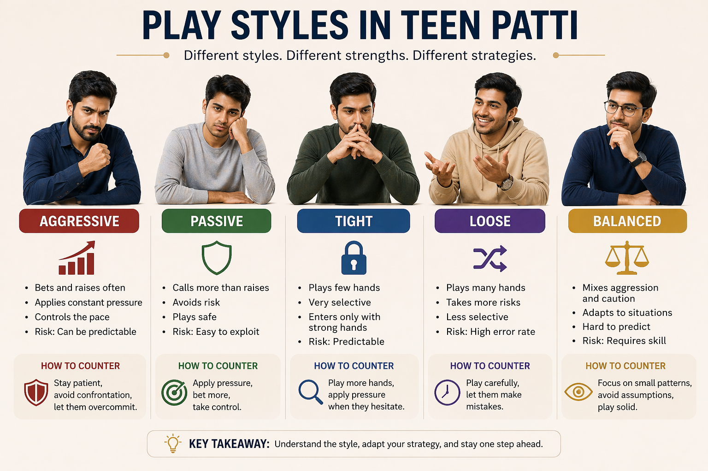

# 🎮 Teen Patti Play Styles: Understanding Player Types and How to Counter Them

## 🪶 Introduction

In Teen Patti, every player has a style — whether they realize it or not.

Some players:

* Bet aggressively
* Play cautiously
* Or constantly change behavior

👉 Understanding play styles allows you to:

* Predict actions
* Adjust your strategy
* Gain a consistent advantage

🎯 This guide will help you identify different play styles and learn how to respond effectively.

---

## 🖼️ Play Styles Overview

---

## 🎯 What Are Play Styles?

Play style is the **consistent way a player approaches the game**, including:

* How often they bet
* How much risk they take
* How they react under pressure

👉 Instead of focusing only on cards, skilled players focus on **player tendencies**.

---

# 🧠 1. Aggressive Play Style

### Characteristics:

* Bets frequently
* Raises often
* Applies pressure constantly

### Strengths:

✔ Forces opponents to fold
✔ Controls the pace of the game

### Weaknesses:

❌ Can become predictable
❌ High risk if misused

---

### 🎯 How to Counter Aggressive Players:

✔ Stay patient
✔ Avoid unnecessary confrontations
✔ Let them overcommit

👉 Aggressive players often defeat themselves if you stay calm.

---

# 🧠 2. Passive Play Style

### Characteristics:

* Calls more than raises
* Avoids risk
* Plays safe

### Strengths:

✔ Low risk
✔ Stable play

### Weaknesses:

❌ Easy to read
❌ Misses opportunities

---

### 🎯 How to Counter Passive Players:

✔ Apply pressure
✔ Increase bets strategically
✔ Take control of the round

👉 Passive players often fold under pressure.

---

# 🧠 3. Tight Play Style

### Characteristics:

* Plays very few hands
* Only enters with strong situations
* Highly selective

### Strengths:

✔ Strong decision quality
✔ Low mistake rate

### Weaknesses:

❌ Predictable
❌ Misses marginal opportunities

---

### 🎯 How to Counter Tight Players:

✔ Play more hands against them
✔ Apply pressure when they hesitate

👉 When they act, take them seriously — but don’t over-respect them.

---

# 🧠 4. Loose Play Style

### Characteristics:

* Plays many hands
* Takes more risks
* Less selective

### Strengths:

✔ Unpredictable
✔ Hard to read

### Weaknesses:

❌ High error rate
❌ Often loses over time

---

### 🎯 How to Counter Loose Players:

✔ Play more carefully
✔ Let them make mistakes
✔ Avoid unnecessary risk

👉 Loose players often lose by overplaying.

---

# 🧠 5. Balanced Play Style

### Characteristics:

* Mixes aggression and caution
* Adapts to different situations
* Hard to predict

### Strengths:

✔ Flexible
✔ Difficult to exploit

### Weaknesses:

❌ Requires high skill
❌ Hard to maintain consistency

---

### 🎯 How to Counter Balanced Players:

✔ Focus on small patterns
✔ Avoid assumptions
✔ Play solid and disciplined

👉 Against balanced players, you must rely on fundamentals.

---

# 🧠 6. Adaptive Play Style (Advanced)

### Characteristics:

* Changes strategy based on opponents
* Adjusts in real time
* Avoids fixed patterns

### Strengths:

✔ Highly effective
✔ Very difficult to read

### Weaknesses:

❌ Requires experience
❌ Mentally demanding

---

### 🎯 How to Counter Adaptive Players:

✔ Stay consistent
✔ Avoid revealing patterns
✔ Focus on long-term strategy

👉 You must outthink them, not outplay them.

---

# 🧠 7. Identifying Play Styles Quickly

### Watch for:

* Frequency of betting
* Reaction to pressure
* Risk tolerance

### Quick classification:

| Behavior         | Likely Style |
| ---------------- | ------------ |
| Constant betting | Aggressive   |
| Frequent folding | Tight        |
| Calls often      | Passive      |
| Random actions   | Loose        |

---

# 🧠 8. Adjusting Your Own Play Style

The best players don’t stick to one style.

### You should:

✔ Adapt based on opponents
✔ Change pace when needed
✔ Avoid becoming predictable

👉 Flexibility is a major advantage.

---

# 🧠 9. Mixing Strategies (Key Skill)

If you always play the same way:

👉 You become easy to read

### Solution:

* Occasionally change behavior
* Vary your decisions
* Control your image

👉 Unpredictability = power

---

## ⚠️ Common Mistakes in Play Styles

* Using only one style
* Not adapting to opponents
* Overusing aggression
* Ignoring table dynamics

---

## 🧾 Summary

Understanding play styles helps you:

* Read opponents quickly
* Adjust your strategy
* Avoid predictable behavior
* Improve long-term performance

🎯 Final takeaway:

👉 **Play styles are not fixed — the best players adapt constantly**

---

## 🔥 SEO Keywords

teen patti play styles
teen patti player types
aggressive vs passive teen patti
teen patti strategy styles
how to read players teen patti

---

## Related Reading
For a broader reference, see [related gameplay notes](https://market-lab-cmd.github.io/Callbreak/)

## Summary
Clear thinking leads to better gameplay outcomes.
