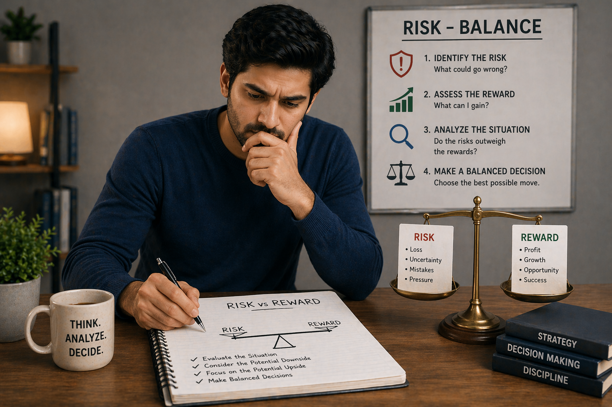

# ⚖️ Risk vs Reward in Teen Patti: How to Balance Decisions and Play Smarter

## 🪶 Introduction

Every decision in Teen Patti involves risk.

* Betting more → higher potential reward
* Playing safe → lower risk, but smaller gains

👉 The key to long-term success is not luck — it is **risk management**.

🎯 This guide will teach you how to:

* Evaluate risk correctly
* Make balanced decisions
* Avoid costly mistakes

---

## 🖼️ Risk Balance Overview

---

## 🎯 What Is Risk vs Reward?

Risk vs Reward means evaluating:

* What you might gain
* What you might lose
* Whether the decision is worth it

👉 Every action should have a **reason**, not just emotion.

---

# 🧠 1. Understanding Risk in Teen Patti

Risk is the possibility of losing value (chips, position, advantage).

### Types of risk:

* Entering with weak situations
* Continuing when uncertain
* Escalating without justification

👉 Not all risks are bad — only **unnecessary risks are dangerous**.

---

# 🧠 2. Understanding Reward

Reward is what you gain when your decision succeeds.

### Examples:

* Winning a round
* Gaining control over the table
* Forcing opponents to fold

👉 A good decision maximizes reward **without exposing you to excessive risk**.

---

# 🧠 3. Low Risk vs High Risk Decisions

### 🔹 Low Risk Decisions

* Conservative play
* Small commitments
* Safer approach

✔ Advantages:

* Stable performance
* Lower losses

❌ Disadvantages:

* Slower gains

---

### 🔸 High Risk Decisions

* Aggressive actions
* Larger commitments
* Pressure-based play

✔ Advantages:

* Higher potential reward

❌ Disadvantages:

* Bigger losses if wrong

---

👉 The goal is not to avoid risk, but to **choose the right level of risk**.

---

# 🧠 4. When to Take Risks

You should take calculated risks when:

✔ You have a strong read on opponents
✔ The potential reward is high
✔ The situation favors you

### Example:

* Opponent seems weak
* Table is passive
* You have positional advantage

👉 This is a **controlled risk**, not a gamble.

---

# 🧠 5. When to Avoid Risk

Avoid risk when:

❌ You lack information
❌ The situation is unclear
❌ Opponents are unpredictable

### Example:

* Multiple strong players still active
* No clear read
* High uncertainty

👉 In these cases, **protect your position**.

---

# 🧠 6. Risk Based on Game Stage

### 🟢 Early Stage

* Risk should be low
* Focus on observation

### 🟡 Mid Stage

* Moderate risk
* Adjust strategy

### 🔴 Late Stage

* Higher risk allowed
* More pressure situations

👉 Risk should increase as information becomes clearer.

---

# 🧠 7. Risk Based on Opponents

Different opponents require different risk levels.

### Against aggressive players:

✔ Reduce unnecessary risk
✔ Let them overcommit

### Against passive players:

✔ Take more controlled risks
✔ Apply pressure

👉 Risk strategy depends on who you are facing.

---

# 🧠 8. Emotional Risk (Most Dangerous)

One of the biggest mistakes is emotional decision-making.

### Signs:

* Chasing losses
* Acting out of frustration
* Taking revenge-style decisions

👉 Emotional risk is **uncontrolled risk**

---

### How to control it:

✔ Stay calm
✔ Take breaks
✔ Stick to logical thinking

---

# 🧠 9. Risk and Table Control

Good players use risk to control the game.

### Example:

* Small risks to test opponents
* Medium risks to apply pressure
* High risks only when justified

👉 Risk becomes a **tool**, not a weakness.

---

# 🧠 10. Risk Evaluation Framework (Simple)

Before making a decision, ask:

1. What is the potential gain?
2. What is the potential loss?
3. How confident am I?
4. What is the situation?

👉 If risk outweighs reward → avoid
👉 If reward justifies risk → proceed

---

# 🧠 11. Long-Term Risk Thinking

Short-term wins can be misleading.

### Smart players think:

* Over many rounds
* Not just one decision

👉 Consistent low-risk + smart high-risk = long-term success

---

# 🧠 12. Avoiding Common Risk Mistakes

❌ Taking risks without reason
❌ Avoiding all risks (too passive)
❌ Overreacting to losses
❌ Ignoring context

👉 Balance is the key.

---

## 🧾 Summary

Risk management is one of the most important skills in Teen Patti.

It allows you to:

* Protect your position
* Make smarter decisions
* Reduce unnecessary losses
* Improve consistency

🎯 Final takeaway:

👉 **Smart players don’t avoid risk — they control it**

---

## 🔥 SEO Keywords

teen patti risk management
teen patti risk vs reward
how to manage risk teen patti
teen patti strategy risk control
teen patti advanced tips

---

## Related Reading
For a broader reference, see [related gameplay notes](https://market-lab-cmd.github.io/Callbreak/)

## Summary
Clear thinking leads to better gameplay outcomes.
