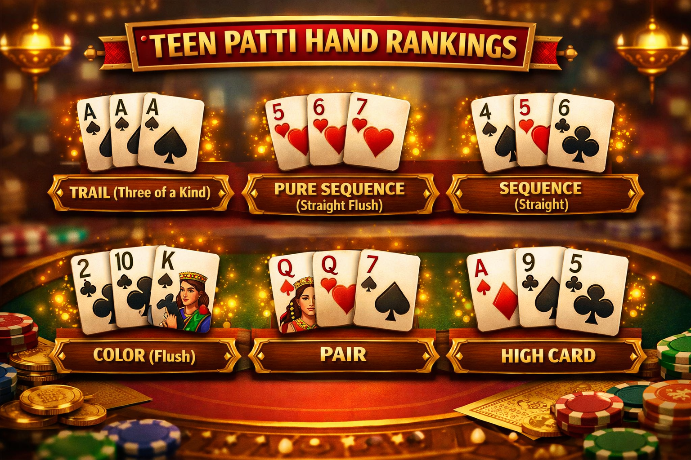

# 🎴 Teen Patti Guide: Rules, Hand Rankings & How to Play (Beginner Guide)

## 🪶 Introduction

Teen Patti, also known as **Indian Poker**, is one of the most popular card games in India. The name "Teen Patti" means *three cards*, and the game is loved for its fast-paced gameplay and strategic depth.

If you're new to the game, this **Teen Patti guide for beginners** will help you understand:

* Rules of Teen Patti
* Hand rankings
* Gameplay steps
* Winning strategies

---

## 🎯 Objective of Teen Patti

The main objective in Teen Patti is:

👉 **To have the strongest three-card hand and win the pot**

Each player is dealt three cards face down, and players bet based on the strength of their hand (or bluff).

---

## 🃏 Teen Patti Hand Rankings (Highest to Lowest)

Understanding hand rankings is essential to winning.

### 🥇 Trail (Three of a Kind)

Three cards of the same rank
Example: A-A-A

### 🥈 Pure Sequence (Straight Flush)

Three consecutive cards of the same suit
Example: ♥️5-6-7

### 🥉 Sequence (Straight)

Three consecutive cards of different suits

### 🎨 Color (Flush)

Same suit, not in sequence

### 👯 Pair

Two cards of the same rank

### 🪶 High Card

No combination

---

## 🖼️ Hand Rankings Chart

---

## 🔄 How to Play Teen Patti (Step-by-Step)

### 1️⃣ Boot Amount

All players place a minimum bet to start the game

### 2️⃣ Deal Cards

Each player gets 3 cards face down

### 3️⃣ Betting Round

Players choose to:

* Fold
* Call
* Raise

👉 This is where bluffing and strategy matter

### 4️⃣ Showdown

Remaining players reveal cards, and the best hand wins

---

## 🖼️ Teen Patti Gameplay

---

## 🧠 Basic Teen Patti Strategy Tips

✔ Play fewer hands but stronger ones
✔ Observe betting patterns
✔ Bluff occasionally but wisely
✔ Manage your bankroll

---

## 🖼️ Strategy Concept

---

## ⚠️ Common Mistakes Beginners Make

* Playing too many weak hands
* Ignoring opponents
* Poor money management
* Revealing emotions

---

## ❓ Teen Patti FAQ (SEO Optimized)

### What is Teen Patti?

Teen Patti is a traditional Indian card game similar to poker, played with three cards.

### How many cards are dealt in Teen Patti?

Each player receives **3 cards face down**.

### What is the highest hand in Teen Patti?

The highest hand is **Trail (Three of a Kind)**.

### Is Teen Patti based on luck or skill?

Teen Patti involves both **luck and strategy**, including bluffing and decision-making.

### Can beginners play Teen Patti easily?

Yes, Teen Patti is beginner-friendly and easy to learn.

### What is the difference between Teen Patti and Poker?

Teen Patti uses only **3 cards**, while poker typically uses **5 cards** and more complex rules.

---

## 🧾 Conclusion

Teen Patti is a fun and strategic card game combining:

* Luck 🎲
* Skill 🧠
* Psychology 🎭

By understanding the rules and practicing consistently, you can improve your gameplay and increase your chances of winning.

---

## 🔥 SEO Keywords (for your repo / page)

Teen Patti guide
how to play Teen Patti
Teen Patti rules
Teen Patti hand rankings
Indian poker game
Teen Patti strategy
Teen Patti tips for beginners

---
